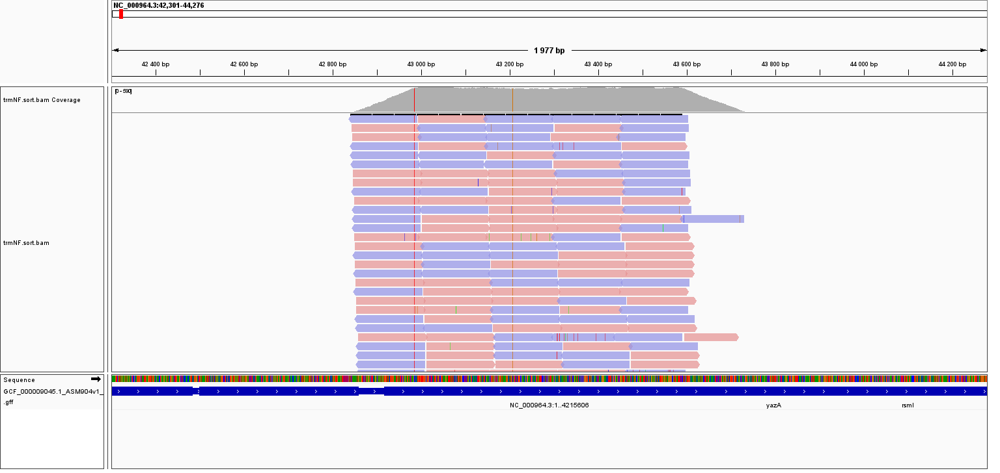

```{r setup, include=FALSE}
knitr::opts_chunk$set(eval=FALSE, echo =TRUE, cache = FALSE, message = FALSE, warning = FALSE, cache.lazy = FALSE,
                      fig.height = 3.5, fig.width = 10.5)
```


# Introduction {-}

Les fichiers sont déposées [ici](https://github.com/lucNegroni/EvaluationM4-M5.git)

l'ensemble du travail est sur le serveur de l'IFB:
[shared/projects/dubii2021/lnegroni/EvaluationM4M5-main](https://jupyterhub.cluster.france-bioinformatique.fr/hub/user-redirect/lab/tree/shared/projects/dubii2021/lnegroni/EvaluationM4M5-main)

Travail sur des données de reséquençage d'un génome bactérien : _Bacillus subtilis_. Les données sont issues de cet article :

* [Complete Genome Sequences of 13 Bacillus subtilis Soil Isolates for Studying Secondary Metabolite Diversity](https://mra.asm.org/content/9/2/e01406-19)

# Analyses

## Organisation de votre espace de travail

```{bash}
# connexion a partir de son PC à IFB
ssh -X lnegroni@core.cluster.france-bioinformatique.fr
#1- Aller dans le bon directory de l'IFB 
cd /shared/projects/dubii2021/lnegroni
# telecharger le TP
wget https://github.com/DU-Bii/EvaluationM4M5/archive/refs/heads/main.zip
# decompresser le .zip
unzip main.zip
#aller dans le dossier cree
cd ./EvaluationM4M5-main
#creer les dossiers de travail
mkdir ./FASQ ./CLEANING ./QC ./MAPPING
```

## Téléchargement des données brutes

Récupérez les fichiers FASTQ issus du run **SRR10390685** grâce à l'outil <strong class="tool">sra-tools</strong> @sratoolkit

```{bash}
# charger le module de sra-tools
module load  sra-tools
#noter la version
fasterq-dump -h #"fasterq-dump" version 2.10.3
#telecharger les .fasq dans le dossier FASQ
srun --cpus-per-task=1 fasterq-dump --split-files -p SRR10390685 --outdir FASQ
# compresser les fichiers
srun gzip *fasq
```

Combien de reads sont présents dans les fichiers R1 et R2 ?

```{bash}
#utilisation du module seqkit 
module load seqkit
srun seqkit stats --threads 1 *.fastq.gz
#resultats:
#file                    format  type   num_seqs        sum_len  min_len  avg_len  max_len
#SRR10390685_1.fastq.gz  FASTQ   DNA   7,066,055  1,056,334,498       35    149.5      151
#SRR10390685_2.fastq.gz  FASTQ   DNA   7,066,055  1,062,807,718      130    150.4      151
```

Les fichiers FASTQ contiennent <code>7 066 055</code> reads.

Téléchargez le génome de référence de la souche ASM904v1 de _Bacillus subtilis_ disponible à [cette adresse](https://ftp.ncbi.nlm.nih.gov/genomes/all/GCF/000/009/045/GCF_000009045.1_ASM904v1/GCF_000009045.1_ASM904v1_genomic.fna.gz)

```{bash}
# telechargement du genome de ref dans le dir MAPPING
cd /shared/projects/dubii2021/lnegroni/EvaluationM4-M5-main/MAPPING
wget https://ftp.ncbi.nlm.nih.gov/genomes/all/GCF/000/009/045/GCF_000009045.1_ASM904v1/GCF_000009045.1_ASM904v1_genomic.fna.gz

```

Quelle est la taille de ce génome ? 

```{bash}
# regarder a quoi ressemble le fichier => c'est un fichier fasta
less CF_000009045.1_ASM904v1_genomic.fna.gz 
#decompression et utilisation de seqkit
gzip -d GCF_000009045.1_ASM904v1_genomic.fna.gz
module load seqkit
srun seqkit stats --threads 1 GCF_000009045.1_ASM904v1_genomic.fasta
 
```

La taille de ce génome est de <code> 4,215,606 </code> paires de bases.

Téléchargez l'annotation de la souche ASM904v1 de _Bacillus subtilis_ disponible à [cette adresse](https://ftp.ncbi.nlm.nih.gov/genomes/all/GCF/000/009/045/GCF_000009045.1_ASM904v1/GCF_000009045.1_ASM904v1_genomic.gff.gz)

```{bash}
wget https://ftp.ncbi.nlm.nih.gov/genomes/all/GCF/000/009/045/GCF_000009045.1_ASM904v1/GCF_000009045.1_ASM904v1_genomic.gff.gz
```

Combien de gènes sont connus pour ce génome ?

```{bash}
# la troisiene colonne du fichier .gff3 contient 3 termes : "gene" ou "cds" ou "mRNA". En supposant qu'il ne faut compter que le ternme "gene":

zcat GCF_000009045.1_ASM904v1_genomic.gff.gz |grep -v "#" | cut -f 3 | grep -c 'gene'
```

<code>4 536</code> gènes sont recensés dans le fichier d'annotation.

## Contrôle qualité

Lancez l'outil <strong class="tool">fastqc</strong> @fastqc dédié à l'analyse de la qualité des bases issues d'un séquençage haut-débit

```{bash}
#memo: à lancer du dossier EvaluationM4M5-main:
srun --cpus-per-task 8 fastqc FASTQ/SRR10390685_1.fastq.gz -o QC/ -t 8
srun --cpus-per-task 8 fastqc FASTQ/SRR10390685_2.fastq.gz -o QC/ -t 8
# resultats enregistrés dans le dossier CLEANING
```

La qualité des bases vous paraît-elle satisfaisante ? Pourquoi ?

- [x ] Oui
- [ ] Non

car <code> le score de qualité est supérieur à 30, la longueur des reads supérieure à 100 et les resultats sont comparables entre R1 et R2  </code> comme le montre <code> les fichiers html pour le (read1) [SRR10390685_1_fastqc.html] et le (read2)[SRR10390685_2_fastqc.html]</code>

Lien vers le [rapport MulitQC](./multiqc_report.html)

Est-ce que les reads déposés ont subi une étape de nettoyage avant d'être déposés ? Pourquoi ?

- [x] Oui
- [ ] Non

car <code>car les reads sont de differentes longueurs </code>

Quelle est la profondeur de séquençage (calculée par rapport à la taille du génome de référence) ?

```{r}
#taille du genome de reference  = 1 242 608 pb
# profondeur = (nb de read * taille des reads) /taille du genome
#file                    format  type   num_seqs        sum_len  min_len  avg_len  max_len
#SRR10390685_1.fastq.gz  FASTQ   DNA   7,066,055  1,056,334,498       35    149.5      151
#SRR10390685_2.fastq.gz  FASTQ   DNA   7,066,055  1,062,807,718      130    150.4      151
profondeur <- c(2*7066055 * 150 /  4215606)
profondeur

```

La profondeur de séquençage est de : <code>503 </code> X.

## Nettoyage des reads

Vous voulez maintenant nettoyer un peu vos lectures. Choisissez les paramètres de <strong class="tool">fastp</strong> @fastp qui vous semblent adéquats et justifiez-les.

```{bash}
# avec fastp
# filtres = mean quality > 30 longueur >=100, garder seulement les paires
#
module load fastp
fatp --version #fastp 0.20.0
# la ligne de la mort: fastp prends en entrée ("--in") les deux fichiers (car paired end) non nettoyés et crée en sortie ("--out")les fastq nettoyés dans le dir "CLEANING". la fin de ligne correspond aux paramêtres et la sortie est fastp.json est remplacée par fastp.log
srun --cpus-per-task 8 fastp --in1 FASTQ/SRR10390685_1.fastq.gz --in2 FASTQ/SRR10390685_2.fastq.gz --out1 CLEANING/SRR10390685_1.cleaned_filtered.fastq.gz --out2 CLEANING/SRR10390685_2.cleaned_filtered.fastq.gz --html CLEANING/fastp.html --thread 8 --cut_mean_quality 30 --cut_window_size 8 --length_required 100 --cut_tail &> CLEANING/fastp.log

```

Les paramètres suivants ont été choisis : 


|Parametre | Valeur | Explication |
|----------|--------|-------------|
| cut_mean_quality |30  | reduit les erreurs de lecture à 1 sur 1000 |
| cut_window_size  |8  |fenetre sur laquelle est calculée Q?  |
| length_required  |100  | les reads doivent être de plus de 100 pb |
| cut tail  |  | supprime les adapateurs?  |

Ces paramètres ont permis de conserver <code>13.554096 M (95.909924%)</code> reads pairés, soit une perte de <code> 4.1% </code>% des reads bruts.

## Alignement des reads sur le génome de référence

Maintenant, vous allez aligner ces reads nettoyés sur le génome de référence à l'aide de <strong class="tool">bwa</strong> @bwa et <strong class="tool">samtools</strong> @samtools.

```{bash}
#version de bwa: 0.7.17-r1188
module load bwa

# alignement
srun --cpus-per-task=32 bwa mem GCF_000009045.1_ASM904v1_genomic.fasta ../CLEANING/SRR10390685_1.cleaned_filtered.fastq.gz ../CLEANING/SRR10390685_2.cleaned_filtered.fastq.gz -t 32 > SRR10390685_on_ASM904.1.sam

# charger samtools 1.10
module load samtools

#transformation en fichier binaire (5Go -> 1.4 Go)
srun --cpus-per-task=8 samtools view --threads 8 SRR10390685_on_ASM904.1.sam -b > SRR10390685_on_ASM904.1.bam

#tri et indexation
srun samtools sort SRR10390685_on_ASM904.1.bam -o SRR10390685_on_ASM904.1.sort.bam
srun samtools index SRR10390685_on_ASM904.1.sort.bam

# suppression des fichiers intermediaires via Jupyter Hub
'''les differentes étapes auraient pu être résumées par:
srun --cpus-per-task=34 bwa mem GCF_000009045.1_ASM904v1_genomic.fasta ../CLEANING/SRR10390685_1.cleaned_filtered.fastq.gz ../CLEANING/SRR10390685_2.cleaned_filtered.fastq.gz -t 32 | srun samtools view -b - | srun samtools sort - > SRR10390685_on_ASM904.1.sort.bam
'''
```

Combien de reads ne sont pas mappés ?

```{bash}
#statistics from samtools
srun samtools idxstats SRR10390685_on_ASM904.1.sort.bam > SRR10390685_on_ASM904.1.sort.bam.idxstats
srun samtools flagstat SRR10390685_on_ASM904.1.sort.bam > SRR10390685_on_ASM904.1.sort.bam.flagstat
# nv de reads non mappés dans le fichier .idxstats
#13571369 + 0 in total (QC-passed reads + QC-failed reads)
#12826829 + 0 mapped (94.51% : N/A)
# soit 744 540 non mappés (5.5%)
```


<code>744 540 (5.5%) </code> reads ne sont pas mappés.

## Croisement de données
*
Calculez le nombre de reads qui chevauchent avec au moins 50% de leur longueur le gène _trmNF_ grâce à l'outil <strong class="tool">bedtools</strong> @bedtools:

```{bash}
# extraire l'annotation de trmNF
grep   "trmNF" GCF_000009045.1_ASM904v1_genomic.gff | awk '$3=="gene"'> trmNF.gff

# pour voir a quoi ca ressemble:
nano trmNF.gff

#recuperer la sequence genomique correspondant à trmNF
module load bedtools
srun bedtools getfasta -fi GCF_000009045.1_ASM904v1_genomic.fasta  -bed trmNF.gff > trmNF.fasta

#recuperer les reads -f 0.5 pour le chevaucheent à 50% min

srun bedtools intersect -a SRR10390685_on_ASM904.1.sort.bam -b trmNF.gff -sorted -f 0.5 >  trmNF.bam

# tri (sort) index et stat avec samtools
srun samtools sort trmNF.bam -o trmNF.sort.bam
srun samtools index trmNF.sort.bam
srun samtools idxstats trmNF.sort.bam > trmNF.sort.bam.idxstats #pas de nom pour les col de ce fichier...
srun samtools flagstat trmNF.sort.bam > trmNF.sort.bam.flagstat
```

<code>2801 </code> reads chevauchent le gène d'intérêt.


## Visualisation
```{bash}
# pour la visualisation
samtools faidx GCF_000009045.1_ASM904v1_genomic.fasta
samptools faidx SRR10390685_on_ASM904.1.sort.bam
samptools faidx trmNF.sort.bam
'''
download des fichiers 
GCF_000009045.1_ASM904v1_genomic.fasta
GCF_000009045.1_ASM904v1_genomic.fasta.ai
SRR10390685_on_ASM904.1.sort.bam
SRR10390685_on_ASM904.1.sort.bam.ai
trmNF.sort.bam
trmNF.sort.bam.ai

installation de IGV sous win10
loading du fichier genomique (fasta) , son annotation (gff) des bam du jeux complet et de trmNF
decouverte du soft et export image de la zone correpondant à trmNF
'''

```
Utilisation de IGV local pour la visualisation:


# References